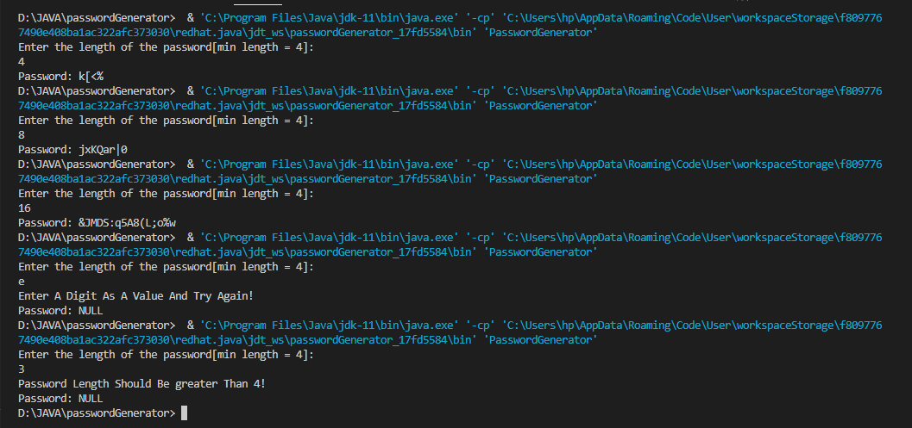

# SIMPLE PASSWORD GENERATOR IN JAVA
- It generates a password with random characters between ASCII codes 33 to 126
- You can set the length of the password you want to be generated
- If you pass a non-digit value as length or a value less that four(4), it gives you an error message

## screenshot

