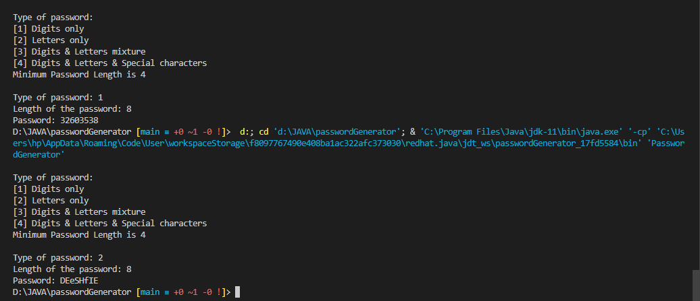

# SIMPLE PASSWORD GENERATOR IN JAVA
- It can generate any type of password i.e digits only, letters only, letters and digits mixture or letters, digits and special characters mixture
- You can set the length of the password you want to be generated
- If you pass a non-digit value as length or a value less that four(4), it gives you an error message

## screenshot

